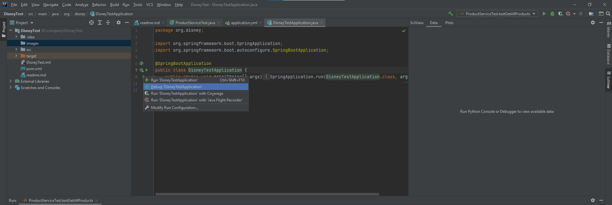
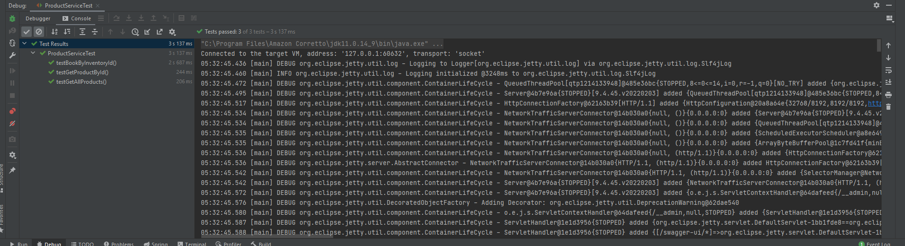

# Disney Home Task

In this test project, I used springboot and wiremock.

### Run wiremock server
Wire mock server resources are in `src/main/resource/mock-server`.
In this directory, can execute `java -jar wiremock-standalone-2.27.0.jar -port=9000` to run mock service.
It will run on `9000` port.

### Run Springboot server
After running wiremock server, we can run springboot server which will be run on the `8090` port.
* We can run the code after opening the source code by using IDEA, and can run the main method which is in the `src/main/java/org/disney/DisneyTestApplication`.
  By default, springboot server will be run `8090` port.
  
  In `org.disney.gateway.ProductGateway`, the remote communication with wiremock server is implemented.
* I attached packed jar file in `resources` folder, so can run springboot by executing `java -jar DisneyTest-1.0-SNAPSHOT.jar` directly.

### Test Code
Test code is in `src/main/java/org/disney/ProductServiceTest`.
In this test, run the mocked server before test, which will be run on `8080` port.
After that check that the service(`org.disney.service.ProductService`) call the mocked server. 

